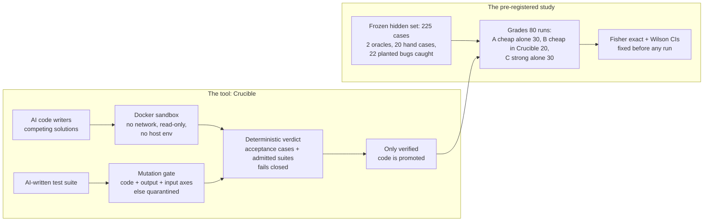

# Crucible

**A verification pipeline for AI-generated code, and a study of when its verdicts can be trusted.**

**Author:** Senan Sumrein · **Status:** work in progress

[](#roadmap)
[](https://github.com/WrdCstlg/crucible-Sept/actions/workflows/ci.yml)
[](LICENSE)
[](https://www.python.org/)

## Executive summary

**The tool.** Crucible is a verification pipeline for AI-generated code. It treats every model as an untrusted contractor:
- several models write competing solutions under forced, different approaches;
- the code runs only in a locked-down Docker sandbox;
- code is promoted only when deterministic checks decide it, never a model's opinion.

**The core problem it attacks: AI tests for AI code.** A model asked to test code will often write tests that are trivial or tautological, or that share the code's own misreading of the spec. Crucible never lets such a suite decide anything on trust:
1. **Ground truth decides.** Human-written acceptance cases always decide. A candidate with no decisive check is `UNVERIFIED` and is never promoted.
2. **AI-written suites must earn admission.** The [mutation gate](crucible/mutation.py) is on by default whenever a trusted reference exists. A suite must pass the reference, then kill at least 60% on three independent axes:
   - **code mutants:** 10 AST operators, with equivalent mutants excluded;
   - **output-contract probes:** corrupt the reference's result;
   - **input-domain probes:** mis-read the reference's input.
   A suite that fails any axis is quarantined and reported, and never blocks.
3. **Each axis closed a measured hole.**
   - A suite that only counted records passed the code axis at 68%; the output probes caught it.
   - A suite with narrow exact checks passed code and output at 100%; the input probes caught it.
   - On the 11 AI-written suites recorded in the pilots, judged against an independent yardstick: two axes agreed on 10 of 11 and admitted one weak suite; three axes agreed on 11 of 11 and admitted none ([report](experiment/gate_validation/REPORT.md)). This is **in-sample calibration**, and its out-of-sample test is pre-registered.
4. **Isolation is a container, not a lint.** Untrusted code runs in a [sandbox](crucible/sandbox.py) with these protections:
   - Docker image pinned by digest;
   - no network, a read-only filesystem and a non-root user;
   - all capabilities dropped, plus memory, CPU and PID limits;
   - no host environment variables, so no API keys leak to model-written code.
   A bare subprocess is available only through an explicit opt-in labelled unsafe. The AST check is a fast lint, not a security boundary.

**The study: can a cheaper model in a strict process beat a stronger model alone?**
- **The pilots don't answer it.** They had at most 5 runs per arm, on a problem both models mostly solved, so no statistical comparison is possible. They are reported as history.
- **The study that can answer it is [pre-registered](experiment/PREREGISTRATION.md) and built.**
  - **A harder problem:** business-hours SLA with holidays, priorities and pauses, plus a performance requirement.
  - **Ground truth that is checked, not trusted:**
    - 225 hidden cases;
    - two independently written oracles that must agree;
    - 20 hand-derived cases, each with a written justification;
    - 22 planted bugs, all caught.
    - An AI assistant drafted this ground truth under the author's direction (see Limitations).
  - **Sample size:** n = 80 runs (30 / 20 / 30).
  - **Statistics fixed in advance:**
    - exact Fisher tests;
    - Wilson intervals;
    - a power statement: it can detect gaps of about 40 points, not small ones.
  - **Rules fixed in advance:**
    - exclusion rules;
    - a hard spend cap;
    - a commitment to publish every result, null or not.
- **The live run is the remaining step.** It needs only a confirmed spend cap. Until its results are committed, the question is open, and this README says so.

**Evidence you can re-check without API keys.** Every recorded verdict replays exactly from the saved artifacts with no model calls, and CI checks it. Every test set is frozen with SHA-256 fingerprints.


---

## Tool and study at a glance



| | What | Read |
|---|---|---|
| **The tool** | Crucible: the pipeline, the sandbox, deterministic verdicts, the mutation gate, and how to run it | [`docs/CRUCIBLE.md`](docs/CRUCIBLE.md) |
| **The study** | Pre-registration: hypotheses, n, tests, exclusions | [`experiment/PREREGISTRATION.md`](experiment/PREREGISTRATION.md) |
| | Method, the problem, the grader and the runner | [`experiment/README.md`](experiment/README.md) |
| | Pilot results (history: small n, not independent) | [`experiment/COMPARISON.md`](experiment/COMPARISON.md) |
| | The full story, including what went wrong | [`case-study/CASE_STUDY.md`](case-study/CASE_STUDY.md) |

## Status

| Done and verified | Remaining |
|---|---|
| Docker sandbox by default; unsafe subprocess only by explicit opt-in; scrubbed environment | **Live study run** (needs a confirmed spend cap); publish results whatever they show |
| Three-axis mutation gate, on by default with a reference; fail-closed baseline; equivalent-mutant filtering | Out-of-sample gate validation (pre-registered H4, runs with the study) |
| Deterministic, fail-closed verdicts with exact replay of every recorded verdict | More problems and domains; stronger isolation (gVisor) for hostile code |
| Harder problem with 2 oracles, hand cases, 22 planted bugs, freeze check | |
| Pre-registered study harness: spend cap, call guard, fixed analysis, mock end-to-end test | |

## Try it

```bash
git clone https://github.com/WrdCstlg/crucible-Sept.git
cd crucible-Sept
pip install -r requirements.txt -r requirements-dev.txt

# The test suite (Docker recommended; on machines without it: CRUCIBLE_SANDBOX=subprocess-unsafe)
python -m pytest -m "not slow"          # fast suites
python -m pytest                        # everything, including the end-to-end mock study (minutes)

# The pipeline on synthetic responses: a weak AI suite is quarantined, a strong one admitted
python run_crucible.py --mock

# The study's ground truth and harness, with no API keys
python experiment/bizsla/grade.py --self-test
python experiment/study/run_study.py --mock --cap-usd 5 --a-runs 3 --b-runs 2 --c-runs 3

# Re-check recorded evidence (zero API keys needed)
python experiment/verify_all.py
```

Live runs and the evaluation rig need API keys: see [`docs/CRUCIBLE.md`](docs/CRUCIBLE.md) and [`experiment/README.md`](experiment/README.md).

## Limitations

- **The main question is not answered until the live study is run.** The pilots are small and their samples were not independent. The study is pre-registered and built but not yet run.
- **Even then, power is limited.** With n = 20 vs 30, the study detects gaps of about 40 points at 80% power. A null result will not mean the arms are equivalent.
- **One problem.** Results will apply to this problem and these models.
- **The gate is a heuristic.** Its 60% thresholds were calibrated in-sample on 11 suites. It measures suites relative to the trusted reference, so it inherits any mistake in the reference.
- **Who wrote the ground truth.** The study's spec, both oracles, the hand cases and the planted bugs were drafted by an AI coding assistant (Claude, via Antigravity) under the author's direction, and none of the models under test saw them. The competitor arm is also a Claude model, so any misreading the two share would bias the result **toward arm C**. Two mitigations reduce this risk without removing it: two algorithmically independent oracles, and hand-derived cases with written justifications for the author to review before the live run.
- **Docker shares the host kernel.** For hostile code, use a stronger runtime such as gVisor. The AST check is a lint, not a boundary.
- **Model outputs aren't deterministic.** They are recorded and replayed; only the verdicts are deterministic.

More detail: the [tool's limitations](docs/CRUCIBLE.md#limitations-of-the-tool) and the [study's limitations](case-study/CASE_STUDY.md#limitations).

## Authorship and integrity

**Who did what:** Senan Sumrein framed the question, chose the problems, made every specification decision for Problems 1–4 and directed the work. Problem 5's spec was drafted by Claude for his review. AI tools did much of the implementation:
- a Gemini-based coding agent (Google Antigravity) built the original pipeline;
- Claude (Anthropic), via Claude Code, audited it and built the experiment harness, the evaluation rig and the analysis;
- Claude (Anthropic), via Google Antigravity, built the follow-up: the Docker sandbox, the three-axis mutation gate, Problem 5's ground truth and grader, the statistics module and the pre-registered study harness.

More in [who did what](case-study/CASE_STUDY.md#how-this-was-built-who-did-what).

**History:** an early version of the project, built with an AI coding agent, presented execution logs that had been edited after the fact. They were removed and the pipeline was rerun; every result since is raw, fingerprinted and independently checkable. The case study tells the whole story, including a harness bug that invalidated one pilot. This repository starts from a clean history.

## License

Copyright © 2026 Senan Sumrein. Licensed under the GNU Affero General Public License v3.0 (AGPL-3.0); see [LICENSE](LICENSE).
