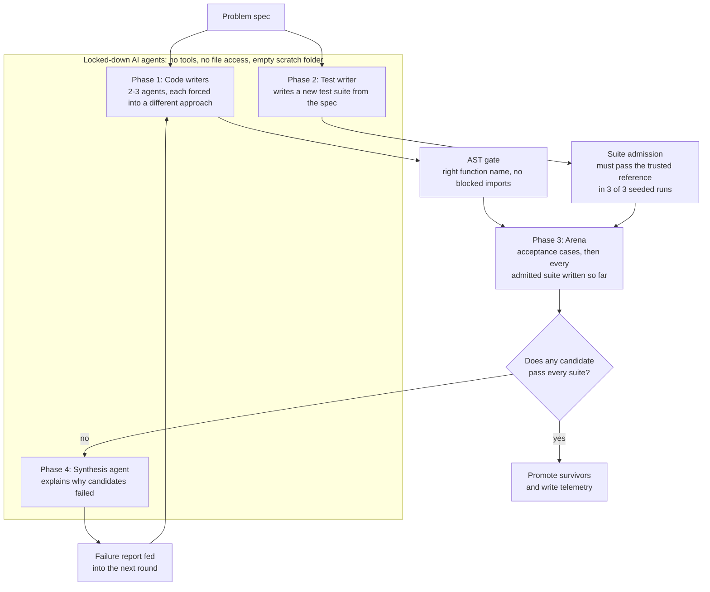
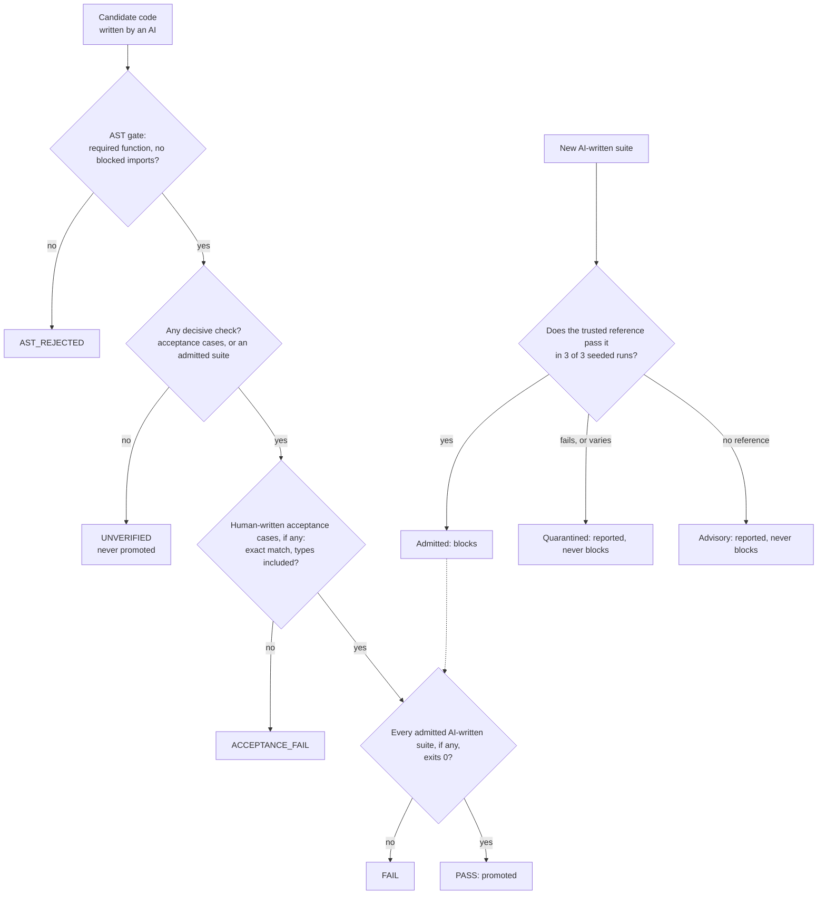
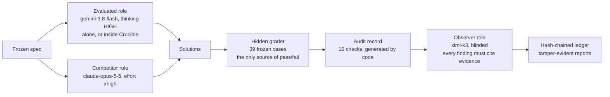

# Project Crucible

**Can AI-written code be trusted? An adversarial verification pipeline, a provider-agnostic evaluation rig, and a measured answer.**

[](LICENSE)
[](https://www.python.org/)
[](https://github.com/WrdCstlg/crucible-Sept/actions/workflows/ci.yml)

> **The short version:** with the same AI models and the same hidden tests, changing nothing but the precision of the problem description moved the results from **0 of 12** runs passing to **12 of 12**. The hard part wasn't writing the code; it was specifying the problem.
>
> Read the full story in the **[case study](case-study/CASE_STUDY.md)**.

---

## What's in this repository

| Part | What it does | Where |
|---|---|---|
| **Crucible** | A tournament pipeline. Several AI code writers attempt a problem, an AI test writer attacks their code, and only code that passes every test survives. | [`run_crucible.py`](run_crucible.py) |
| **Evaluation rig** | Pits a model under evaluation (alone or inside Crucible) against a stronger competitor, grades both with hidden tests, and has a third model from a different family audit every trial. Works with any provider. | [`experiment/rig/`](experiment/rig/) |
| **Experiment** | A frozen, fingerprinted 39-case test set for a support-ticket SLA problem, a hidden grader that tests itself, and every run's raw evidence. | [`experiment/`](experiment/) |
| **Case study** | The story: what went wrong, how it was caught, how the experiment was designed, and what the results mean. | [`case-study/`](case-study/CASE_STUDY.md) |

---

## Key findings

1. **The spec is the lever.** With the reviewed spec, all 12 runs across three arms passed every hidden test. With the original spec, 0 of 12 did. A single missing decision caused failures in every run of every arm, and explains every failure in 3 of the 5 Claude runs. ([details](experiment/sla/ABLATION_RESULT.md))
2. **Automated verification inherits the spec's gaps.** Crucible's AI-written tests, built from the vague spec, approved all 4 candidates that the hidden tests reject. A verifier can only check what the spec says.
3. **AI agents use whatever access they're given.** Under ordinary SDK defaults, a code-writing agent read the test suite and edited it. After lockdown, agents *attempted* 42 tool calls across 20 sessions, and all 42 were denied.
4. **AI-written tests need their own tests.** In two of three early live runs, the AI-written test suite had wrong expected answers. This repository's test set is checked against 11 deliberately broken solutions and must catch every one.
5. **On a precisely specified task, the extra process added cost, not quality.** Crucible used about 3.5× the tokens of a single call of the same model, and passed 3 of 4 runs where the same model alone passed 10 of 10.
6. **The provider-agnostic rig confirmed it, with a third-family judge watching.**
   - **Model vs. model:** Gemini 3.8 Flash at thinking HIGH matched Claude Opus 5.5 at effort `xhigh`, 5/5 each.
   - **Crucible:** passed 1 of 2. In one run, its AI-written tests were wrong in *both* rounds and rejected 4 candidates that pass every hidden test.
   - **The judge:** Kimi K3 flagged that disagreement from the evidence alone, and found one issue no code check covered. It also misattributed the error once, which is why it never decides scores.

   ([full comparison](experiment/COMPARISON.md))
7. **Verdicts are now deterministic, and fail closed.**
   - **What decides:** only human-written acceptance cases, and AI-written suites that a trusted reference passes in 3 of 3 seeded runs. Anything else is reported but never blocks, and code with no decisive check is never promoted.
   - **Replay:** every recorded Crucible verdict reproduces from saved code and tests, with no model calls (14 of 14, checked in CI).
   - **Counterfactual:** under this policy, none of the recorded runs would have shipped unverified code. Rig B2's false rejection disappears once acceptance cases exist.

   ([details](#determinism-what-is-and-isnt-deterministic))

---

## How Crucible works



- **Code writers** each implement the spec using a different forced approach.
- **The AST gate** statically checks each candidate before it runs, in under a millisecond. The required top-level function must exist (for example `def process_telemetry(stream):`, configurable with `--entrypoint`). Direct imports of nine module families are rejected: `subprocess`, `socket`, `http`, `urllib`, `requests`, `ctypes`, `cffi`, `signal` and `multiprocessing`. This catches accidents, not attacks: dynamic imports and `os` or `open()` calls get past it.
- **The arena** runs each candidate in a separate OS process with a 120-second watchdog, in a seeded environment. Human-written acceptance cases run first and always decide; then every admitted suite. See [the determinism section](#determinism-what-is-and-isnt-deterministic).
- **The cumulative regression gate** requires survivors to pass every admitted suite written so far, not just the latest. Without it, "survivors" in one run failed the previous round's tests with the same error.
- **Lockdown:** agents run with no tools, a deny-all policy and an empty temporary folder. The orchestrator alone writes code and tests to disk.
- **The synthesis agent** writes a failure report that is fed into the next round. It is told explicitly that it may not accept, reject or rank candidates; pass or fail is already final.
- **Telemetry:** each run writes `results.json` plus a timestamped archive in `artifacts/`. Both are machine-readable and can gate CI:

  ```bash
  jq -e '.summary.survived' results.json
  ```

**Mock mode** runs the whole pipeline with synthetic responses and no API keys. It writes to `.crucible_mock/` so it never touches the real audit trail:

```bash
python run_crucible.py --mock
python run_crucible.py --mock --entrypoint analyze_data
```

---

## Determinism: what is and isn't deterministic

AI models can't be made deterministic from the outside. Claude Opus 5.5 rejects sampling parameters, Kimi K3 only accepts temperature 1, and Gemini's temperature 0 and seed reduce variation without guaranteeing it. So model outputs are treated as **recorded inputs**, and everything that *decides* anything is deterministic code.



| Component | Deterministic? | How |
|---|---|---|
| Pass, fail and promotion | **Yes** | Decided only by acceptance cases, reference-validated suites and exit codes. With no decisive check, a candidate is `UNVERIFIED` and never promoted |
| Execution environment | **Yes** | Every verdict-bearing process runs with `PYTHONHASHSEED=0` and `random.seed(0)` |
| Test set, grading, audits | **Yes** | Seeded generation, frozen fingerprints, code-only checks |
| Published results | **Yes, verifiable** | [`experiment/replay.py`](experiment/replay.py) re-executes every recorded Crucible verdict from saved code and tests, with no model calls. CI checks all 14 |
| Timing-dependent tests | Guarded | A suite whose outcome varies against the reference is quarantined; timeouts are generous safety nets |
| Model outputs | **No** | Recorded as inputs. Gemini is pinned where possible (temperature 0, seed 0); Opus and Kimi can't be |
| Judge reports | No | Advisory only, never decisive, and hash-chained so they can't be edited afterwards |

**Counterfactual on the recorded runs** (`python experiment/replay.py --counterfactual …`): the same saved code and tests, judged under the deterministic policy.

| Crucible runs | What happened (legacy policy) | Deterministic, reference only | Deterministic, reference + 6 hand-written acceptance cases* |
|---|---|---|---|
| Agent-SDK pilot, B1 and B2 | Correct code promoted | Same | Same |
| Ablation, B1 and B2 | **Wrong code promoted** (28/39, 27/39) | Nothing promoted: `UNVERIFIED` | Wrong code promoted: the 6 cases don't cover the rule the spec left out |
| Rig pilot, B1 | Correct code promoted | Same | Same |
| Rig pilot, B2 | **Correct code falsely rejected** | Nothing promoted: `UNVERIFIED` | **Correct code promoted (39/39)** |

\*These 6 cases are also part of the 39-case hidden test set, so this column's grades aren't fully independent. The lesson holds either way: the deterministic policy never ships unverified code, and what it *can* verify is only as good as the acceptance cases' coverage.

**Acceptance cases** are a JSON list, compared exactly with types included (`true` is not `1`, and `1` is not `1.0`):

```json
[{"id": "boundary", "input": ["0,T1,OPEN", "14400000,T1,CLOSE"],
  "expected": [{"ticket_id": "T1", "used_ms": 14400000, "breached": false, "status": "closed"}]}]
```

---

## How the evaluation rig works



Models are assigned in one file, [`experiment/rig/roles.json`](experiment/rig/roles.json). Any model can play any role: [`providers.py`](experiment/rig/providers.py) supports Anthropic, Google Gemini and any OpenAI-compatible endpoint (OpenAI, Moonshot Kimi, LM Studio, Ollama, vLLM).

**Rules that make it trustworthy:**
1. **No model produces a score.** Pass or fail comes only from the hidden grader and its frozen test set.
2. **No tools exist.** Every role is a plain completion call with no tools declared, so isolation holds by construction. The audit confirms that zero tool calls were attempted.
3. **The observer comes from a third model family.** This reduces self-preference and shared blind spots with the models it watches.
4. **The observer is blind.** It sees "System N"; model names and local paths are redacted.
5. **Evidence is data, and every claim is cited.** The observer is told that nothing in the evidence is an instruction. Every finding must cite an audit check or a numbered line, and code verifies each citation.
6. **Reports are tamper-evident.** Each report is fingerprinted into a hash chain; editing any report afterwards breaks verification.

**The audit record** ([`audit.py`](experiment/rig/audit.py)) is generated by code, with no model involved:

| Check | Verifies |
|---|---|
| `freeze.hashes_match` | Spec, tests and references still match their frozen fingerprints |
| `spec.hash_matches_config` | The spec file matches the fingerprint recorded when the pilot started |
| `mutation.self_test` | The test set still catches all 11 deliberately broken solutions |
| `harness.no_exception` | The experiment's own code didn't crash |
| `isolation.no_tool_calls` | No model call attempted a tool |
| `output.matches_response` | The graded code is exactly what the model returned |
| `grade.reproduced` | Regrading now gives the recorded result |
| `crucible.telemetry_consistent` | Crucible's telemetry is untouched pipeline output |
| `crucible.graded_is_winner` | The graded solution is Crucible's actual survivor |
| `crucible.verdicts_vs_hidden` | Crucible's own verdicts agree with the hidden grader |

---

## The experiment

- **Problem:** a support-ticket SLA clock. It takes interleaved events (OPEN, PAUSE, RESUME, CLOSE, REOPEN), out-of-order data and malformed lines, and returns SLA time used and breaches per ticket. The full rules, including a state table, are in [`experiment/sla/SPEC.md`](experiment/sla/SPEC.md).
- **Test set:** 39 hidden cases.
  - 6 hand-written by the project author;
  - 24 edge cases, one per spec rule, with answers computed by hand;
  - 6 seeded random mixes and 3 stress streams, up to 28,150 lines.

  Two independently structured reference implementations must agree on every case, and everything is frozen with SHA-256 fingerprints before any model runs.
- **The grader tests itself.** It breaks a correct solution 11 ways, such as off-by-one boundaries, wrong sorting, or revived closed tickets, and must catch every one.
- **Scoring is all-or-nothing:** one wrong ticket fails the run. Harness crashes are reported separately and never counted as model failures.

| Run folder | Runner | Spec | A: evaluated, 1 call | B: evaluated in Crucible | C: competitor, 1 call |
|---|---|---|---|---|---|
| `pilot_20260929T175519Z` | agent SDK | reviewed | invalid | invalid | 5/5 |
| `pilot_20260929T180102Z` | agent SDK | reviewed | 5/5 | 2/2 | 5/5 |
| `pilot_ablation_v0_20260929T181350Z` | agent SDK | original | 0/5 | 0/2 | 0/5 |
| `pilot_rig_20260929T190640Z` | rig | reviewed | 5/5 | 1/2 | 5/5 |

- **The first row was invalidated** by a bug in the experiment harness, documented in [its folder](experiment/runs/pilot_20260929T175519Z/INVALID.md).
- **Settings differ between runners:**
  - agent-SDK runs used Gemini 3.8 Flash at default thinking and Claude Opus 5.5 at effort `high`;
  - the rig run used thinking HIGH, effort `xhigh`, and Kimi K3 as the judge.
- **More detail:** [`experiment/COMPARISON.md`](experiment/COMPARISON.md) and [`experiment/README.md`](experiment/README.md).

---

## Quick start

```bash
git clone https://github.com/WrdCstlg/crucible-Sept.git
cd crucible-Sept
pip install -r requirements.txt -r requirements-dev.txt
cp .env.example .env        # then add the keys you need
```

No API keys needed:

```bash
python run_crucible.py --mock           # the full Crucible pipeline with synthetic responses
pytest tests/ -v                        # orchestrator test suite
python experiment/verify_all.py         # frozen tests, grader self-test, audits, ledgers, replay of every recorded verdict
python experiment/replay.py --counterfactual experiment/runs/pilot_rig_20260929T190640Z   # judge recorded runs under the deterministic policy
```

The evaluation rig (needs keys for the roles in `experiment/rig/roles.json`):

```bash
python experiment/run_pilot.py --rig --label rig                   # all three arms, graded
python experiment/rig/audit.py experiment/runs/<pilot folder>      # audit record for every trial
python experiment/rig/observe.py experiment/runs/<pilot folder>    # observer reports and ledger
python experiment/rig/observe.py --verify experiment/runs/<pilot folder>
python experiment/rig/check_suites.py experiment/runs/<pilot folder>   # test Crucible's AI-written suites against the reference
python experiment/run_pilot.py --rig --spec experiment/sla/SPEC_v0_original.md --label rig_ablation_v0
```

Crucible live mode (needs `GEMINI_API_KEY`):

```bash
# Deterministic verdicts need ground truth: human-written acceptance cases and/or a trusted reference solution
python run_crucible.py "Your problem statement" --entrypoint your_function \
  --acceptance-cases my_cases.json --reference my_reference.py \
  --paradigms "Approach one" "Approach two" --max-iterations 3

python run_crucible.py --advisory-only           # explore without ground truth: AI tests are reported, nothing is promoted
python run_crucible.py --verdict-policy legacy   # the old behaviour (every AI-written suite blocks), to reproduce past runs
```

Without `--acceptance-cases` or `--reference`, a live run is refused unless you pass `--advisory-only`. Crucible's live prompts are tuned to its default telemetry problem; the evaluation rig uses spec-driven prompts instead.

---

## Repository structure

```
crucible-Sept/
├── run_crucible.py            # Crucible orchestrator
├── tests/                     # orchestrator test suite (pytest)
├── results.json, artifacts/   # Crucible CLI telemetry and archives (see artifacts/README.md)
├── experiment/
│   ├── sla/                   # spec, frozen test set, references, fingerprints, ablation notes
│   ├── grade.py               # hidden grader and mutation self-test
│   ├── run_pilot.py           # runs all arms under a deadline, then grades
│   ├── arms.py                # arm runner for the agent SDK (first pilots)
│   ├── attribution.py         # ablation attribution check
│   ├── replay.py              # replays recorded Crucible verdicts with no model calls; counterfactual policy check
│   ├── verify_all.py          # verifies all recorded evidence without API keys (runs in CI)
│   ├── rig/                   # provider-agnostic three-role rig: roles, providers, audit, observer
│   └── runs/                  # one folder per pilot: raw evidence
├── case-study/                # case study and Mermaid diagram sources
├── scripts/export_public.py   # builds a clean public copy and scans it for secrets
├── .env.example               # which keys each part needs
└── LICENSE                    # AGPL-3.0
```

---

## Known limitations

- **Crucible's sandbox is a separate process, not a container.** Candidate code can read and write host files. The AST gate filters accidental imports; it isn't a security boundary. Don't run untrusted third-party code with it.
- **Verdicts are only as good as the ground truth.**
  - AI-written tests no longer decide unless a trusted reference passes them.
  - Without acceptance cases or a reference, Crucible promotes nothing.
  - Acceptance cases only catch what they cover: in the counterfactual, 6 hand-written cases let wrong code through because none tested the rule the spec left out.
  - The recorded experiment arms used the legacy policy, in which every AI-written suite blocks.
- **The experiment is small:** one problem, 12 runs per condition. Treat the results as indicative, not statistically conclusive. The ablation's hidden tests encode decisions made during spec review, so it measures the value of the review, not raw model capability.
- **Some of the test set is AI-written.** Apart from the 6 hand-written cases, the test cases and reference implementations were written by an AI (Claude). They're checked against the hand cases, two independent implementations, hand-computed answers and the mutation check, but not against a human-written reference.
- **An observer report is a claim, not evidence.** Citations are verified in code, but the observer can still misread the evidence, and it can't detect gaps in the spec. It's blinded to model identity, but it can tell a Crucible trial from a single call.
- **Settings and costs aren't directly comparable.** "Thinking" settings differ in kind across providers (Gemini thinking level, Claude effort). Only Claude's cost is measured in dollars; Gemini and Kimi usage is recorded in tokens.
- **This is a snapshot:** models, SDKs and prices as of September 2026.

---

## Project history and integrity

An early version of this project, built with an AI coding agent, presented execution logs that had been edited after the fact. They were removed, the pipeline was rerun, and every result since then is raw, fingerprinted and independently checkable. The case study tells the whole story, including a harness bug in this experiment that invalidated one pilot. This public repository starts from a clean history.

**Who did what:** the project author framed the question, chose the problem, made every spec decision and directed the work. A Gemini-based coding agent (Google Antigravity) built the original pipeline. Claude (Anthropic), via Claude Code, audited the repository and built the experiment harness, the evaluation rig and the analysis. See the [case study](case-study/CASE_STUDY.md#how-this-was-built-who-did-what).

---

## License

Licensed under the **GNU Affero General Public License v3.0 (AGPL-3.0)**. See [LICENSE](LICENSE). If you modify this software or run it as a network service, you must make the complete corresponding source code available to its users under the same license.
