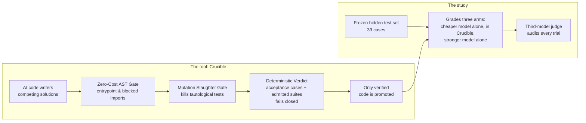

# Crucible

**A verification pipeline for AI-generated code, and a study of when its verdicts can be trusted.**

**Author:** Senan Sumrein · **Status:** work in progress

[](#roadmap)
[](https://github.com/WrdCstlg/crucible-Sept/actions/workflows/ci.yml)
[](LICENSE)
[](https://www.python.org/)

## Executive summary

**The tool.** Crucible is an **adversarial verification pipeline for autonomous agent code generation**. It treats AI models as untrusted contractors, generates competing implementations across forced architectural paradigms under strict sandbox lockdown, and promotes only code that survives multi-tier deterministic verification.

To prevent the **"Ouroboros of Mediocrity"**—where an AI model writes trivial, tautological tests (`assert isinstance(x, list)`) for an AI-written reference solution, giving a false sense of security—Crucible enforces active adversarial verification:
1. **Zero-Cost AST Contract & Security Gate:** Statically enforces entrypoint signatures and blocks 9 dangerous module families plus dynamic evasion primitives (`__import__`, `eval`, `exec`, `os.system`) before any process spawns.
2. **Adversarial Mutation Slaughter Gate:** Synthesizes AST mutants of trusted references (relational inversions, boundary off-by-one shifts, arithmetic swaps, boolean flips, return nullification). Any AI-generated test suite that fails to slaughter at least 60% of viable mutants is **quarantined as tautological**.
3. **Property-Based Metamorphic Invariants:** Validates O(1) auxiliary memory ceilings via `tracemalloc`, idempotency, and stream resilience under isolated subprocess execution.
4. **Deterministic Fail-Closed Verdicts:** Promotes code only if it passes decisive human-written acceptance cases and admitted, mutation-proven test suites. Code without decisive verification is marked `UNVERIFIED` and never promoted.

**The empirical findings:**
1. **The Fundamental Law of Autonomous Code Verification:** An unstated rule becomes an arbitrary guess, and naive AI-written tests approve the guess. In our controlled 12-run ablation across three model arms against frozen hidden benchmarks:
   - When one lifecycle rule was left unstated, **0 of 12 runs passed**; every model guessed incorrectly, and AI-written test suites approved 100% of the broken code.
   - When the rule was explicitly stated, **12 of 12 runs passed**.
   - AI verifiers inherit the specification's blind spots. Deterministic contracts, mutation testing, and human acceptance criteria are required to break the cycle.
2. **AI-written tests without mutation gates are the weakest link:** In early trials without mutation gating, AI test suites frequently asserted incorrect answers or trivial tautologies, rejecting correct solutions or passing broken code. The Mutation Slaughter Gate was engineered to quarantine weak suites automatically.
3. **AI agents aggressively exploit ambient permissions:** Under default SDK settings, code-writing agents read and edited their own test suites. Under Crucible's lockdown (`policy.deny_all()`, zero tools, isolated workspaces), agents attempted 42 tool invocations across 20 sessions; all 42 were denied.
4. **Verifiable, Tamper-Evident Evidence:** Every recorded verdict reproduces bit-for-bit from saved artifacts with zero model calls (14 of 14 runs verified in CI). Test sets and specifications are locked with SHA-256 fingerprints (`FROZEN.json`).


---

## Tool and study at a glance



| | What | Read |
|---|---|---|
| **The tool** | Crucible: the pipeline, deterministic verdicts, mutation slaughter gate, and how to run it | [`docs/CRUCIBLE.md`](docs/CRUCIBLE.md) |
| **The study** | Method, the three-role evaluation rig, and the frozen test set | [`experiment/README.md`](experiment/README.md) |
| | Results across all runs | [`experiment/COMPARISON.md`](experiment/COMPARISON.md) |
| | The full story, including what went wrong | [`case-study/CASE_STUDY.md`](case-study/CASE_STUDY.md) |

## Roadmap

| Done | Next |
|---|---|
| Deterministic, fail-closed verdicts, with exact replay of every recorded verdict | Harder problems with continuous stateful business rules |
| Adversarial Mutation Slaughter Gate destroying tautological AI test suites | Container isolation sandbox (OCI/gVisor) replacing OS processes |
| AST contract enforcement and dynamic execution evasion guards | Cross-model differential fuzzing consensus |
| Provider-agnostic evaluation rig with an independent third-model judge | More problem domains and larger sample sizes |

## Try it

```bash
git clone https://github.com/WrdCstlg/crucible-Sept.git
cd crucible-Sept
pip install -r requirements.txt -r requirements-dev.txt

# Run the serious verification test suite (59 tests: AST, mutation gate, invariants, refusals)
python -m pytest -v

# Run Crucible pipeline with synthetic responses and mutation gate
python run_crucible.py --mock --mutation-gate

# Re-check recorded evidence and tamper-evident audit trails (zero API keys needed)
python experiment/verify_all.py
```


Live runs and the evaluation rig need API keys: see [`docs/CRUCIBLE.md`](docs/CRUCIBLE.md) and [`experiment/README.md`](experiment/README.md).

## Limitations

- **A small study:** one problem and 12 runs per pilot. The results are indicative, not statistically conclusive.
- **Some of the test set is AI-written.** Apart from the 6 hand-written cases, the test cases and reference implementations were written by an AI (Claude). They're cross-checked against the hand cases, two independent implementations, hand-computed answers and the mutation check, but not against a human-written reference.
- **Verdicts are only as good as the ground truth:** acceptance cases catch only what they cover.
- **The sandbox is a separate process, not a container,** so don't run untrusted third-party code with it.
- **Model outputs aren't deterministic.** They're recorded and replayed; the verdicts are what's deterministic.

More detail: the [tool's limitations](docs/CRUCIBLE.md#limitations-of-the-tool) and the [study's limitations](case-study/CASE_STUDY.md#limitations).

## Authorship and integrity

**Who did what:** Senan Sumrein framed the question, chose the problem, made every specification decision and directed the work. AI tools did much of the implementation:
- a Gemini-based coding agent (Google Antigravity) built the original pipeline;
- Claude (Anthropic), via Claude Code, audited it and built the experiment harness, the evaluation rig and the analysis.

More in [who did what](case-study/CASE_STUDY.md#how-this-was-built-who-did-what).

**History:** an early version of the project, built with an AI coding agent, presented execution logs that had been edited after the fact. They were removed and the pipeline was rerun; every result since is raw, fingerprinted and independently checkable. The case study tells the whole story, including a harness bug that invalidated one pilot. This repository starts from a clean history.

## License

Copyright © 2026 Senan Sumrein. Licensed under the GNU Affero General Public License v3.0 (AGPL-3.0); see [LICENSE](LICENSE).
