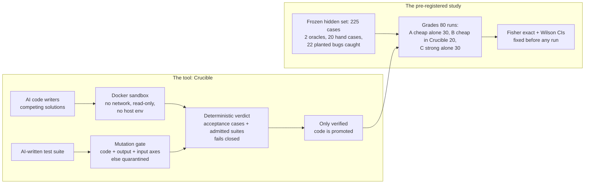

# Crucible

**A verification pipeline for AI-generated code, and a study of when its verdicts can be trusted.**

**Author:** Senan Sumrein · **Status:** work in progress

[](#roadmap)
[](https://github.com/WrdCstlg/crucible-Sept/actions/workflows/ci.yml)
[](LICENSE)
[](https://www.python.org/)

## Executive summary

**The tool.** Crucible is a verification pipeline for AI-generated code. It treats every model as an untrusted contractor:
- several models write competing solutions under forced, different approaches;
- the code runs only in a locked-down Docker sandbox;
- code is promoted only when deterministic checks decide it, never a model's opinion.

**The core problem it attacks: AI tests for AI code.** A model asked to test code will often write tests that are trivial or tautological, or that share the code's own misreading of the spec. Crucible never lets such a suite decide anything on trust:
1. **Ground truth decides.** Human-written acceptance cases always decide. A candidate with no decisive check is `UNVERIFIED` and is never promoted.
2. **AI-written suites must earn admission.** The [mutation gate](crucible/mutation.py) is on by default whenever a trusted reference exists. A suite must pass the reference, then kill at least 60% on three independent axes:
   - **code mutants:** 10 AST operators, with equivalent mutants excluded;
   - **output-contract probes:** corrupt the reference's result;
   - **input-domain probes:** mis-read the reference's input.
   A suite that fails any axis is quarantined and reported, and never blocks.
3. **Each axis closed a measured hole.**
   - A suite that only counted records passed the code axis at 68%; the output probes caught it.
   - A suite with narrow exact checks passed code and output at 100%; the input probes caught it.
   - On 11 suites from the pilots (7 recorded AI-written suites plus 4 hand-written controls), judged against an independent yardstick: two axes agreed on 10 of 11 and admitted one weak suite; three axes agreed on 11 of 11 and admitted none ([report](experiment/gate_validation/REPORT.md)). That was **in-sample calibration**.
   - **Out of sample, in the pre-registered study:** 7 of 18 fresh AI-written suites (39%) encoded at least one wrong answer; the gate quarantined all 7. The 11 it admitted each caught 18–21 of 21 planted bugs they never saw: 18/18 agreement, 0 false security ([results](experiment/STUDY_RESULTS.md#h4-does-the-mutation-gate-keep-tautological-ai-tests-out)).
4. **Isolation is a container, not a lint.** Untrusted code runs in a [sandbox](crucible/sandbox.py) with these protections:
   - Docker image pinned by digest;
   - no network, a read-only filesystem and a non-root user;
   - all capabilities dropped, plus memory, CPU and PID limits;
   - no host environment variables, so no API keys leak to model-written code.
   A bare subprocess is available only through an explicit opt-in labelled unsafe. The AST check is a fast lint, not a security boundary.

**The study: can a cheaper model in a strict process beat a stronger model alone?**
- **Answer, for this problem and these models: no.** The study was [pre-registered](experiment/PREREGISTRATION.md), run once (80 of 80 runs, 0 harness errors, $27 of a $100 cap) and published in full: [**study results**](experiment/STUDY_RESULTS.md).

  | Arm | Strict passes (all 225 hidden cases) | 95% Wilson | Cost |
  |---|---|---|---|
  | A: gemini-3.8-flash, 1 call | 29/30 (97%) | 83–99% | $4.50 |
  | B: gemini-3.8-flash in Crucible | 18/20 (90%) | 70–97% | $8.69 |
  | C: claude-opus-5-5, 1 call | 30/30 (100%) | 89–100% | $8.36 |

  - **H1, B vs C:** no detectable difference (Fisher p = 0.155). **H2, B vs A:** none (p = 0.556). A B rate of 74% or lower would have been detected with 80% power; smaller gaps could not be.
  - **Why:** a ceiling. The problem was built to be hard, yet the cheap model alone solved 29 of 30, leaving a process nothing to add. B's two failures were API calls that hung until the 45-minute limit, not wrong code; they count as failures, as pre-registered.
  - **Cost:** B cost about as much as C with no accuracy gain. On this problem, the cheap model alone was the best buy.
  - **Crucible's own verdicts (H3):** it never rejected correct code (0 of 38), and promoted 2 of 36 candidates that the hidden grader failed, because arm B's only ground truth was the spec's 4 worked examples. Crucible is only as strong as the acceptance tests it is given.
- **What the study rested on:**
  - **A harder problem:** business-hours SLA with holidays, priorities and pauses, plus a performance requirement.
  - **Ground truth that is checked, not trusted:** 225 hidden cases; two independently written oracles that must agree; 20 hand-derived cases, each with a written justification; 22 planted bugs, all caught. An AI assistant drafted this ground truth under the author's direction (see Limitations).
  - **Rules fixed before any run:** n = 80 (30 / 20 / 30); exact Fisher tests and Wilson intervals; exclusion rules; a hard spend cap; a commitment to publish every result, null or not.
- **The pilots** (at most 5 runs per arm, samples not independent) are kept as history only.

**Evidence you can re-check without API keys.** Every recorded verdict replays exactly from the saved artifacts with no model calls, and CI checks it. Every test set is frozen with SHA-256 fingerprints.


---

## Tool and study at a glance



| | What | Read |
|---|---|---|
| **The tool** | Crucible: the pipeline, the sandbox, deterministic verdicts, the mutation gate, and how to run it | [`docs/CRUCIBLE.md`](docs/CRUCIBLE.md) |
| **The study** | **Results: the answer, deviations, limits** | [`experiment/STUDY_RESULTS.md`](experiment/STUDY_RESULTS.md) |
| | Pre-registration: hypotheses, n, tests, exclusions | [`experiment/PREREGISTRATION.md`](experiment/PREREGISTRATION.md) |
| | Method, the problem, the grader and the runner | [`experiment/README.md`](experiment/README.md) |
| | Pilot results (history: small n, not independent) | [`experiment/COMPARISON.md`](experiment/COMPARISON.md) |
| | The full story, including what went wrong | [`case-study/CASE_STUDY.md`](case-study/CASE_STUDY.md) |

## Status

| Done and verified | Remaining |
|---|---|
| Docker sandbox by default; unsafe subprocess only by explicit opt-in; scrubbed environment | **A problem hard enough to separate the arms** (this one hit a ceiling); needs a new confirmed spend cap |
| Three-axis mutation gate, on by default with a reference; fail-closed baseline; equivalent-mutant filtering | Out-of-sample test of the gate against weak-but-reference-passing suites (none occurred in the study) |
| Deterministic, fail-closed verdicts with exact replay of every recorded verdict | More problems and domains; stronger isolation (gVisor) for hostile code |
| Harder problem with 2 oracles, hand cases, 22 planted bugs, freeze check | |
| Pre-registered study harness: spend cap, call guard, fixed analysis, mock end-to-end test | |
| **Live study run and published** (80/80 runs; H1/H2 null with a ceiling; H4 criterion met) | |

## Try it

```bash
git clone https://github.com/WrdCstlg/crucible-Sept.git
cd crucible-Sept
pip install -r requirements.txt -r requirements-dev.txt

# The test suite (Docker recommended; on machines without it: CRUCIBLE_SANDBOX=subprocess-unsafe)
python -m pytest -m "not slow"          # fast suites
python -m pytest                        # everything, including the end-to-end mock study (minutes)

# The pipeline on synthetic responses: a weak AI suite is quarantined, a strong one admitted
python run_crucible.py --mock

# The study's ground truth and harness, with no API keys
python experiment/bizsla/grade.py --self-test
python experiment/study/run_study.py --mock --cap-usd 5 --a-runs 3 --b-runs 2 --c-runs 3

# Re-check recorded evidence (zero API keys needed), including the published study's grades and analysis
python experiment/verify_all.py
python experiment/verify_all.py --regrade-study   # also re-grade every study solution in Docker (slow)
```

Live runs and the evaluation rig need API keys: see [`docs/CRUCIBLE.md`](docs/CRUCIBLE.md) and [`experiment/README.md`](experiment/README.md).

## Limitations

- **The main question is answered only for this problem.** On it, the answer is no, and the problem hit a ceiling: every arm scored 90–100%. Whether a process helps on a problem the cheap model usually fails remains untested.
- **Power is limited.** With n = 20 vs 30 and C at 100%, the study could detect B at or below about 74%, not smaller gaps. The null result does not mean the arms are equivalent.
- **One problem.** Results apply to this problem and these models.
- **The gate is a heuristic.** Its 60% thresholds were calibrated in-sample on 11 suites and held out of sample (18/18), but no weak-but-reference-passing suite appeared out of sample to test its mutation axes. It measures suites relative to the trusted reference, so it inherits any mistake in the reference.
- **Who wrote the ground truth.** The study's spec, both oracles, the hand cases and the planted bugs were drafted by an AI coding assistant (Claude, via Antigravity) under the author's direction, and none of the models under test saw them. The competitor arm is also a Claude model, so any misreading the two share would bias the result **toward arm C**; arm C's 30/30 is consistent with that bias or with a strong model, and the study cannot tell them apart. Two mitigations reduce this risk without removing it: two algorithmically independent oracles, and hand-derived cases with written justifications.
- **Docker shares the host kernel.** For hostile code, use a stronger runtime such as gVisor. The AST check is a lint, not a boundary.
- **Model outputs aren't deterministic.** They are recorded and replayed; only the verdicts are deterministic.

More detail: the [tool's limitations](docs/CRUCIBLE.md#limitations-of-the-tool) and the [study's limitations](case-study/CASE_STUDY.md#limitations).

## Authorship and integrity

**Who did what:** Senan Sumrein framed the question, chose the problems, made every specification decision for Problems 1–4 and directed the work. Problem 5's spec was drafted by Claude for his review. AI tools did much of the implementation:
- a Gemini-based coding agent (Google Antigravity) built the original pipeline;
- Claude (Anthropic), via Claude Code, audited it and built the experiment harness, the evaluation rig and the analysis;
- Claude (Anthropic), via Google Antigravity, built the follow-up: the Docker sandbox, the three-axis mutation gate, Problem 5's ground truth and grader, the statistics module and the pre-registered study harness.

More in [who did what](case-study/CASE_STUDY.md#how-this-was-built-who-did-what).

**History:** an early version of the project, built with an AI coding agent, presented execution logs that had been edited after the fact. They were removed and the pipeline was rerun; every result since is raw, fingerprinted and independently checkable. The case study tells the whole story, including a harness bug that invalidated one pilot. This repository starts from a clean history.

## License

Copyright © 2026 Senan Sumrein. Licensed under the GNU Affero General Public License v3.0 (AGPL-3.0); see [LICENSE](LICENSE).
