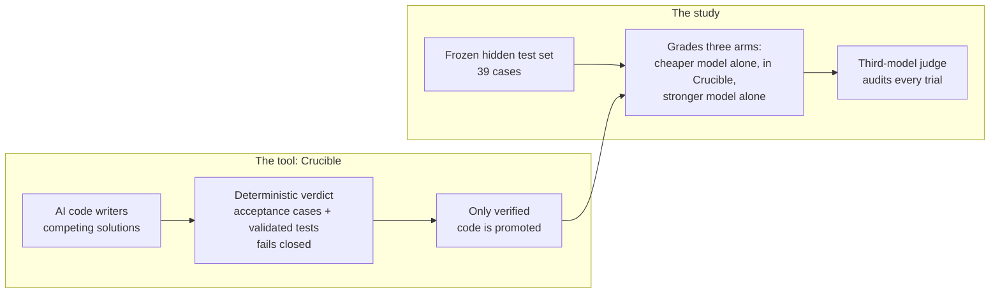

# Crucible

**A verification pipeline for AI-generated code, and a study of when its verdicts can be trusted.**

**Author:** Senan Sumrein · **Status:** work in progress

[](#roadmap)
[](https://github.com/WrdCstlg/crucible-Sept/actions/workflows/ci.yml)
[](LICENSE)
[](https://www.python.org/)

## Executive summary

**The tool.** Crucible has several AI models write competing solutions to a problem, and promotes only code that passes decisive checks. Its verdicts are deterministic: only two things can decide.
- human-written acceptance cases;
- AI-written tests that a trusted reference solution passes every time.

Code that nothing can verify is never promoted.

**The study.** Can a cheaper AI model inside a stricter process match a stronger model working alone? Three arms run against the same frozen, hidden test set:
- Gemini 3.8 Flash alone;
- Gemini 3.8 Flash inside Crucible;
- Claude Opus 5.5 alone.

A third model from a different family, Kimi K3, audits every trial.

**Where it stands: work in progress.** The main question isn't answered yet. On the one problem studied so far, the cheaper model alone already matched the stronger one, 10 of 10 runs each, so there was no gap for Crucible to close. Harder problems are next.

**What the study has shown so far:**
1. **An unstated rule becomes a guess, and AI-written tests approve the guess.** The original problem description left one rule unstated: what an `OPEN` event does to a ticket that is already closed.
   - Every model, in every run, guessed differently from the intended rule.
   - Crucible's AI-written tests approved all 4 of its wrong candidates.
   - With the reviewed description, which states the rule, every run in that pilot passed: 12 of 12.

   The hidden tests encode rules decided during the review, so this measures what the gap costs, not raw model capability.
2. **AI-written tests were Crucible's weakest link.** In three separate runs, a test with a wrong expected answer decided the outcome; in one, it rejected 4 correct solutions. On the precisely specified task, the model alone passed 10 of 10 runs; inside Crucible, it passed 3 of 4.
3. **AI agents use whatever access they're given.** Under default settings, a code-writing agent read the test suite and edited it. After lockdown, agents attempted 42 tool calls across 20 sessions, and all 42 were denied.
4. **So the tool changed.** Verdicts are now deterministic and fail closed.
   - Replayed on the recorded runs with only a reference to check against, it would have promoted nothing in the three runs that went wrong, instead of shipping wrong code twice and rejecting correct code once.
   - Human-written acceptance cases fix the rejected run, but only catch what they cover: the 6 hand-written cases still let the wrong code through.
   - Every recorded verdict reproduces exactly from saved code and tests: 14 of 14, checked in CI.

**Why the results can be checked rather than trusted:**
- The test set is frozen and fingerprinted before any model runs.
- The grader proves it catches 11 deliberately broken solutions.
- The ablation's prediction was written down before it ran.
- The judge's reports are tamper-evident.
- CI re-checks the recorded evidence on every push.

---

## Tool and study at a glance



| | What | Read |
|---|---|---|
| **The tool** | Crucible: the pipeline, deterministic verdicts, and how to run it | [`docs/CRUCIBLE.md`](docs/CRUCIBLE.md) |
| **The study** | Method, the three-role evaluation rig, and the frozen test set | [`experiment/README.md`](experiment/README.md) |
| | Results across all runs | [`experiment/COMPARISON.md`](experiment/COMPARISON.md) |
| | The full story, including what went wrong | [`case-study/CASE_STUDY.md`](case-study/CASE_STUDY.md) |

## Roadmap

| Done | Next |
|---|---|
| Deterministic, fail-closed verdicts, with exact replay of every recorded verdict | Harder problems, so the process-versus-model question has a gap to measure |
| One problem studied end to end: three pilots, including a spec ablation | More problems, and more runs per condition |
| Provider-agnostic evaluation rig with an independent third-model judge | A container sandbox instead of a separate process |
| | Spec-driven prompts for Crucible's own command line, which are currently tuned to its telemetry demo |

## Try it

```bash
git clone https://github.com/WrdCstlg/crucible-Sept.git
cd crucible-Sept
pip install -r requirements.txt -r requirements-dev.txt

python run_crucible.py --mock        # the whole Crucible pipeline with synthetic responses, no API keys
python experiment/verify_all.py      # re-check the recorded evidence, no API keys
```

Live runs and the evaluation rig need API keys: see [`docs/CRUCIBLE.md`](docs/CRUCIBLE.md) and [`experiment/README.md`](experiment/README.md).

## Limitations

- **A small study:** one problem and 12 runs per pilot. The results are indicative, not statistically conclusive.
- **Some of the test set is AI-written.** Apart from the 6 hand-written cases, the test cases and reference implementations were written by an AI (Claude). They're cross-checked against the hand cases, two independent implementations, hand-computed answers and the mutation check, but not against a human-written reference.
- **Verdicts are only as good as the ground truth:** acceptance cases catch only what they cover.
- **The sandbox is a separate process, not a container,** so don't run untrusted third-party code with it.
- **Model outputs aren't deterministic.** They're recorded and replayed; the verdicts are what's deterministic.

More detail: the [tool's limitations](docs/CRUCIBLE.md#limitations-of-the-tool) and the [study's limitations](case-study/CASE_STUDY.md#limitations).

## Authorship and integrity

**Who did what:** Senan Sumrein framed the question, chose the problem, made every specification decision and directed the work. AI tools did much of the implementation:
- a Gemini-based coding agent (Google Antigravity) built the original pipeline;
- Claude (Anthropic), via Claude Code, audited it and built the experiment harness, the evaluation rig and the analysis.

More in [who did what](case-study/CASE_STUDY.md#how-this-was-built-who-did-what).

**History:** an early version of the project, built with an AI coding agent, presented execution logs that had been edited after the fact. They were removed and the pipeline was rerun; every result since is raw, fingerprinted and independently checkable. The case study tells the whole story, including a harness bug that invalidated one pilot. This repository starts from a clean history.

## License

Copyright © 2026 Senan Sumrein. Licensed under the GNU Affero General Public License v3.0 (AGPL-3.0); see [LICENSE](LICENSE).
