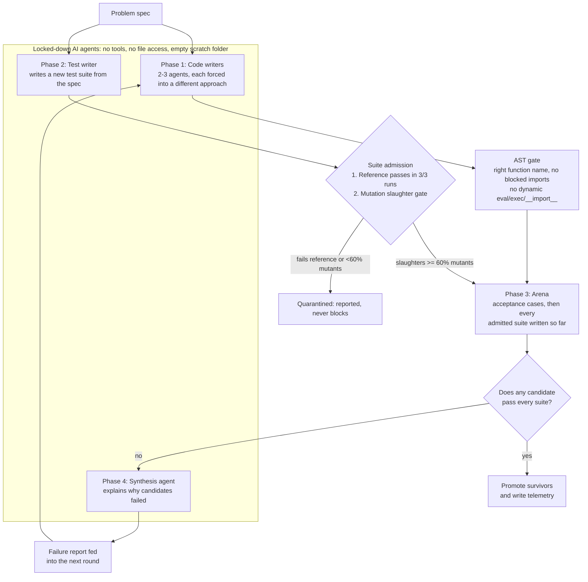
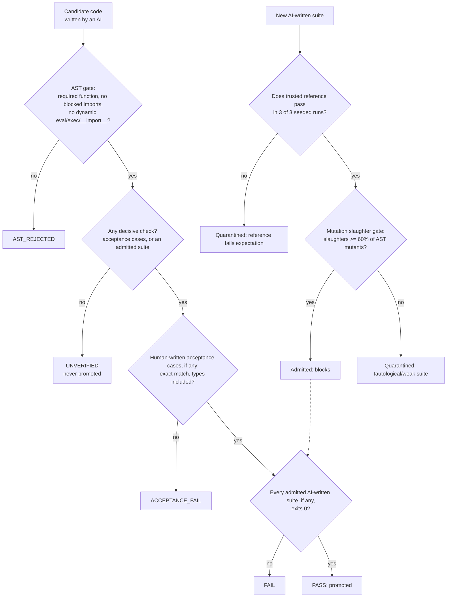

# Crucible: tool reference

Crucible has several AI models write competing solutions to a problem, checks every candidate, and promotes only code that passes decisive, deterministic checks. This page documents the tool. The study that tests it is documented in [`experiment/`](../experiment/README.md).

## The pipeline



- **Code writers** each implement the spec using a different forced approach.
- **The AST gate** statically checks each candidate before it runs, in under a millisecond.
  - The required top-level function must exist, for example `def process_telemetry(stream):`; set the name with `--entrypoint`.
  - Direct imports of nine module families are rejected: `subprocess`, `socket`, `http`, `urllib`, `requests`, `ctypes`, `cffi`, `signal` and `multiprocessing`.
  - Dynamic execution primitives are rejected at the AST level: `__import__`, `eval`, `exec`, `compile`, and process calls like `os.system` and `os.popen`.
- **The Adversarial Mutation Slaughter Gate (`--mutation-gate`)**:
  - Solves the **"Ouroboros of Mediocrity"**: when an AI writes tests for an AI reference solution, it frequently produces tautological, trivial assertions (`assert isinstance(result, list)`) that create a dangerous false sense of security.
  - Automatically synthesizes AST mutants of the reference (relational inversions, boundary off-by-one shifts, arithmetic swaps, boolean flips, return nullification).
  - Any test suite that fails to slaughter at least 60% of viable mutants is **quarantined as tautological**.
- **The arena** runs each candidate in a separate OS process with a 120-second watchdog, in a seeded environment. Human-written acceptance cases run first and always decide, then every admitted suite.
- **The cumulative regression gate** requires survivors to pass every admitted suite written so far, not just the latest.
- **Lockdown:** agents run with no tools, a deny-all policy and an empty temporary folder. The orchestrator alone writes code and tests to disk.
- **The synthesis agent** writes a failure report that is fed into the next round. It may not accept, reject or rank candidates.
- **Telemetry:** each run writes `results.json`, a timestamped archive in `artifacts/`, and every round's candidates and suites in `rounds/`, so the run can be replayed. The JSON can gate CI: `jq -e '.summary.survived' results.json`.

## Deterministic verdicts

AI models can't be made deterministic from the outside:
- Claude Opus 5.5 rejects sampling parameters.
- Kimi K3 only accepts temperature 1.
- Gemini's temperature 0 and seed reduce variation without guaranteeing it.

So model outputs are treated as recorded inputs, and everything that decides anything is deterministic code.




| Component | Deterministic? | How |
|---|---|---|
| Pass, fail and promotion | **Yes** | Decided only by acceptance cases, reference-validated suites and exit codes. With no decisive check, a candidate is `UNVERIFIED` and never promoted |
| Execution environment | **Yes** | Every verdict-bearing process runs with `PYTHONHASHSEED=0` and `random.seed(0)` |
| Recorded verdicts | **Yes, verifiable** | [`experiment/replay.py`](../experiment/replay.py) re-executes every recorded verdict from saved code and tests, with no model calls; CI checks all of them |
| Timing-dependent tests | Guarded | A suite whose outcome varies against the reference is quarantined; timeouts are generous safety nets |
| Model outputs | **No** | Recorded as inputs |

Verdict policies (`--verdict-policy`):
- **`deterministic` (default).** Acceptance cases always decide. An AI-written suite decides only if the trusted reference passes it in every one of `--stability-runs` seeded runs (default 3); otherwise it's quarantined or advisory. A candidate with no decisive check is `UNVERIFIED`.
- **`legacy`.** Every AI-written suite blocks. This is the behavior before 2026-09-29, kept so recorded runs can be reproduced.

How the recorded runs would have fared under the deterministic policy is in [`experiment/COMPARISON.md`](../experiment/COMPARISON.md).

## Using it

```bash
pip install -r requirements.txt -r requirements-dev.txt
cp .env.example .env                              # add GEMINI_API_KEY for live runs

python run_crucible.py --mock                     # the whole pipeline with synthetic responses, no keys
python run_crucible.py --mock --entrypoint analyze_data

# Live runs need ground truth: human-written acceptance cases and/or a trusted reference solution
python run_crucible.py "Your problem statement" --entrypoint your_function \
  --acceptance-cases my_cases.json --reference my_reference.py \
  --mutation-gate --mutation-threshold 0.60 \
  --paradigms "Approach one" "Approach two" --max-iterations 3

python run_crucible.py --advisory-only            # explore without ground truth: nothing is ever promoted
python run_crucible.py --verdict-policy legacy    # reproduce the old behaviour
```

Without `--acceptance-cases` or `--reference`, a live run is refused unless you pass `--advisory-only`.
When `--mutation-gate` is active, any candidate test suite must kill at least the specified threshold (default: 60%) of synthetic AST mutants derived from the reference, or it is quarantined as a tautological suite. Mock mode writes to `.crucible_mock/` and never touches the real audit trail.

**Acceptance cases** are a JSON list, compared exactly, with types included (`true` is not `1`, and `1` is not `1.0`):

```json
[{"id": "boundary", "input": ["0,T1,OPEN", "14400000,T1,CLOSE"],
  "expected": [{"ticket_id": "T1", "used_ms": 14400000, "breached": false, "status": "closed"}]}]
```

## Limitations of the tool

- **The sandbox is a separate process, not a container.** Candidate code can read and write host files. Don't run untrusted third-party code with it.
- **Verdicts are only as good as the ground truth.** Acceptance cases catch only what they cover, and without them or a reference, nothing is promoted.
- **Crucible's own live prompts are tuned to its telemetry demo problem.** The study's evaluation rig drives Crucible with spec-driven prompts instead.
