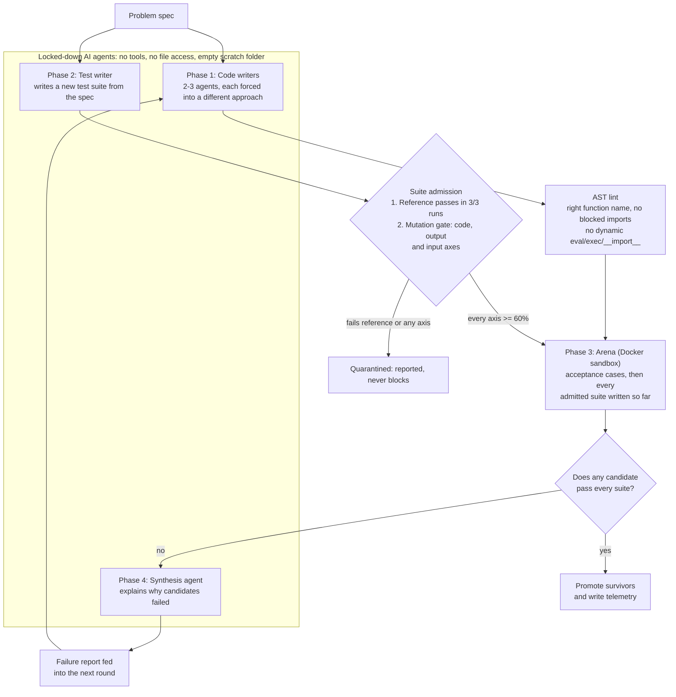
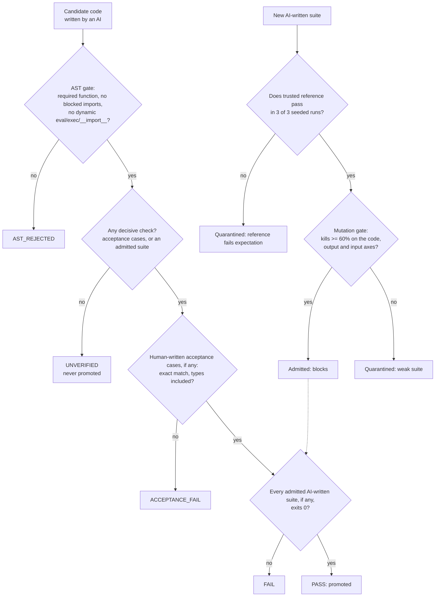

# Crucible: tool reference

Crucible has several AI models write competing solutions to a problem, checks every candidate, and promotes only code that passes decisive, deterministic checks. This page documents the tool. The study that tests it is documented in [`experiment/`](../experiment/README.md).

## The pipeline



- **Code writers** each implement the spec using a different forced approach.
- **The AST lint** statically checks each candidate before it runs, in under a millisecond. It is a fast code-quality filter, **not a security boundary**: Python offers too many ways around any static blocklist. The Docker sandbox is the boundary.
  - The required top-level function must exist, for example `def process_telemetry(stream):`; set the name with `--entrypoint`.
  - Direct imports of nine module families are rejected: `subprocess`, `socket`, `http`, `urllib`, `requests`, `ctypes`, `cffi`, `signal` and `multiprocessing`.
  - Dynamic execution primitives are rejected at the AST level: `__import__`, `eval`, `exec`, `compile`, and process calls like `os.system` and `os.popen`.
- **The mutation gate** ([`crucible/mutation.py`](../crucible/mutation.py)) is **on by default whenever a trusted reference is given** (`--no-mutation-gate` turns it off). It is the answer to AI-written tests that are trivial or tautological. An AI-written suite decides nothing until it passes three checks:
  - **Baseline.** The trusted reference must pass the suite. If it fails, or if no mutants can be generated, the suite is quarantined (fail closed).
  - **Code axis.** Ten AST operators (relational, boundary +1/-1, arithmetic, augmented assignment, logical, condition negation, boolean flip, statement deletion, return nullification), sampled round-robin. Mutants that behave identically to the reference on a differential corpus are excluded as equivalent, so they can't dilute the score.
  - **Output axis.** 10 probes wrap the reference and corrupt its return value: drop, duplicate or empty records; shift a number by 1; rename or drop a field; flip booleans; alter strings. This catches suites that only count records or check types.
  - **Input axis.** 10 probes wrap the reference and mis-read its input: upper-case or lower-case the text, squash whitespace, truncate decimals, drop the first or last item, reverse, sort, de-duplicate, shift numbers by 1. This catches suites that only exercise a narrow set of inputs.
  - Probes whose output equals the reference's on the whole differential corpus are excluded as equivalent.
  - A suite must kill at least the threshold (default 60%) **on every axis**, or it is quarantined.
  - **How far to trust it:** on 11 suites from the pilots (7 recorded AI-written suites plus 4 hand-written controls), two axes agreed with an independent yardstick on 10 of 11 and admitted one weak suite; all three axes agreed on 11 of 11 with no weak suite admitted ([`experiment/gate_validation/REPORT.md`](../experiment/gate_validation/REPORT.md)). Those thresholds were calibrated on the same suites, so that is in-sample. **Out of sample** (pre-registered H4, [`experiment/STUDY_RESULTS.md`](../experiment/STUDY_RESULTS.md)), on 18 fresh AI-written suites for a different problem: 7 (39%) encoded a wrong answer and were quarantined at the baseline step; the 11 admitted each caught 18–21 of 21 planted bugs they never saw; agreement 18/18, false security 0. No weak-but-reference-passing suite occurred, so the code/output/input axes were not challenged out of sample.
- **The arena** runs each candidate in the sandbox ([`crucible/sandbox.py`](../crucible/sandbox.py)) with a watchdog and a seeded, scrubbed environment. Human-written acceptance cases run first and always decide, then every admitted suite.
  - **Docker (default):** a fresh container from a digest-pinned image, with no network, a read-only root filesystem and the code mounted read-only, a non-root user, all capabilities dropped, memory, CPU and PID limits, and no host environment variables.
  - **`--unsafe-subprocess-sandbox` / `CRUCIBLE_SANDBOX=subprocess-unsafe`:** a plain OS process with a scrubbed environment. You must opt in explicitly, and it is labelled unsafe everywhere it is used.
  - If Docker is unavailable, Crucible refuses to run instead of quietly falling back.
- **Invariants (`--invariants`):** checks idempotence (the same input twice gives the same output) and purity (the input is not mutated).
- **The cumulative regression gate** requires survivors to pass every admitted suite written so far, not just the latest.
- **Lockdown:** agents run with no tools, a deny-all policy and an empty temporary folder. The orchestrator alone writes code and tests to disk.
- **The synthesis agent** writes a failure report that is fed into the next round. It may not accept, reject or rank candidates.
- **Telemetry:** each run writes `results.json`, a timestamped archive in `artifacts/`, and every round's candidates and suites in `rounds/`, so the run can be replayed. The JSON can gate CI: `jq -e '.summary.survived' results.json`.

## Deterministic verdicts

AI models can't be made deterministic from the outside:
- Claude Opus 5.5 rejects sampling parameters.
- Kimi K3 only accepts temperature 1.
- Gemini's temperature 0 and seed reduce variation without guaranteeing it.

So model outputs are treated as recorded inputs, and everything that decides anything is deterministic code.




| Component | Deterministic? | How |
|---|---|---|
| Pass, fail and promotion | **Yes** | Decided only by acceptance cases, reference-validated suites and exit codes. With no decisive check, a candidate is `UNVERIFIED` and never promoted |
| Execution environment | **Yes** | Every verdict-bearing process runs with `PYTHONHASHSEED=0` and `random.seed(0)` |
| Recorded verdicts | **Yes, verifiable** | [`experiment/replay.py`](../experiment/replay.py) re-executes every recorded verdict from saved code and tests, with no model calls; CI checks all of them |
| Timing-dependent tests | Guarded | A suite whose outcome varies against the reference is quarantined; timeouts are generous safety nets |
| Model outputs | **No** | Recorded as inputs |

Verdict policies (`--verdict-policy`):
- **`deterministic` (default).** Acceptance cases always decide. An AI-written suite decides only if the trusted reference passes it in every one of `--stability-runs` seeded runs (default 3); otherwise it's quarantined or advisory. A candidate with no decisive check is `UNVERIFIED`.
- **`legacy`.** Every AI-written suite blocks. This is the behavior before 2026-09-29, kept so recorded runs can be reproduced.

How the recorded runs would have fared under the deterministic policy is in [`experiment/COMPARISON.md`](../experiment/COMPARISON.md).

## Using it

```bash
pip install -r requirements.txt -r requirements-dev.txt
cp .env.example .env                              # add GEMINI_API_KEY for live runs

python run_crucible.py --mock                     # the whole pipeline with synthetic responses, no keys
python run_crucible.py --mock --entrypoint analyze_data

# Live runs need ground truth: human-written acceptance cases and/or a trusted reference solution.
# With --reference the mutation gate is on by default; output runs in Docker unless you opt out explicitly.
python run_crucible.py "Your problem statement" --entrypoint your_function \
  --acceptance-cases my_cases.json --reference my_reference.py \
  --mutation-threshold 0.60 --equivalence-corpus my_inputs.json --invariants \
  --paradigms "Approach one" "Approach two" --max-iterations 3

python run_crucible.py --advisory-only            # explore without ground truth: nothing is ever promoted
python run_crucible.py --verdict-policy legacy    # reproduce the old behaviour
```

Without `--acceptance-cases` or `--reference`, a live run is refused unless you pass `--advisory-only`. Every gate verdict is recorded in telemetry (schema 1.3.0), including the per-axis scores and surviving mutants, so you can see exactly why a suite was quarantined. Mock mode writes to `.crucible_mock/` and never touches the real audit trail. In mock mode, round 1's suite is deliberately weak and is quarantined (code 25/37, output 1/9, input 0/6); round 2's suite is admitted (37/37, 9/9, 5/6).

**Acceptance cases** are a JSON list, compared exactly, with types included (`true` is not `1`, and `1` is not `1.0`):

```json
[{"id": "boundary", "input": ["0,T1,OPEN", "14400000,T1,CLOSE"],
  "expected": [{"ticket_id": "T1", "used_ms": 14400000, "breached": false, "status": "closed"}]}]
```

## Limitations of the tool

- **Verdicts are only as good as the ground truth.** Acceptance cases catch only what they cover. The mutation gate measures a suite *relative to the trusted reference*, so if the reference is wrong, the gate admits suites that encode the same mistake. Without acceptance cases or a reference, nothing is promoted. Measured cost of thin ground truth: in the study, Crucible ran with only the spec's 4 worked examples as acceptance cases and promoted 2 of 36 candidates that a 225-case hidden grader failed.
- **The gate is a calibrated heuristic, not a proof.** Mutation score is a proxy for suite strength. Its 60% thresholds were calibrated in-sample on 11 suites and held on 18 out-of-sample suites (H4), but no weak-but-reference-passing suite appeared out of sample.
- **The AST lint is not a security boundary.** Isolation comes from the Docker sandbox. Docker shares the host kernel; for hostile code, use a stronger runtime such as gVisor.
- **`subprocess-unsafe` gives no isolation** beyond a scrubbed environment. Use it only for trusted code or in CI on throwaway runners.
- **Crucible's own live prompts are tuned to its telemetry demo problem.** The study's evaluation rig drives Crucible with spec-driven prompts instead.
