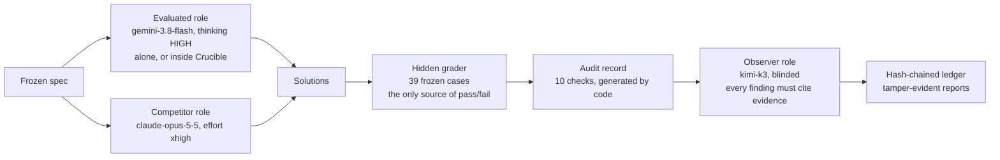

# The study: experiment and evaluation rig

This folder is the study that puts the Crucible tool ([`docs/CRUCIBLE.md`](../docs/CRUCIBLE.md)) under test. Its question: does a cheaper model, alone or inside Crucible, match a stronger model at writing correct code? Every result can be checked by a skeptical reader.

**Status.**
- **The pilots (Problems 1–4, `experiment/sla`, `experiment/runs/pilot_*`) are history, not evidence about rates.** They had n ≤ 5 per arm, on a problem the cheaper model alone already solved as well as the stronger one, so Crucible had no gap to close and no statistical comparison is possible.
- **The study that answers the question is pre-registered:** [`PREREGISTRATION.md`](PREREGISTRATION.md). It uses a harder problem (`bizsla/`), independent samples, n = 80 (A 30 / B 20 / C 30), exact Fisher tests with a power statement, and fixed exclusion and publication rules. The harness has been tested end to end on a zero-cost mock provider.
- **The live run is waiting** on the user confirming a spend cap. Until its results are committed under `runs/study_*`, the question remains open.

Pilot results are in [`COMPARISON.md`](COMPARISON.md), and the narrative is in the [case study](../case-study/CASE_STUDY.md).

## The pre-registered study (Problem 5: business-hours SLA)

| Piece | What it guarantees |
|---|---|
| [`bizsla/SPEC.md`](bizsla/SPEC.md) | Business-hours SLA with P1–P4 limits, holidays, priority changes, pause/resume/close/reopen, an exact breach-minute rule and a 10 s performance requirement. It is the only problem text any arm sees. |
| [`bizsla/reference.py`](bizsla/reference.py) + [`bizsla/brute_force.py`](bizsla/brute_force.py) | Two independently written oracles: closed-form calendar arithmetic, and a minute-by-minute simulation. They must agree on every non-stress case. |
| [`bizsla/hand_cases.json`](bizsla/hand_cases.json) | 20 cases whose expected outputs were derived by hand, each with a written justification. Both oracles must match them. |
| [`bizsla/generate_cases.py`](bizsla/generate_cases.py) | 201 generated cases (edge, random, holiday, churn, medium) plus 4 stress cases from a version-independent SplitMix PRNG. Frozen by `FROZEN.json`; `--check` fails on any change. |
| [`bizsla/grade.py`](bizsla/grade.py) | Hidden grader running in the Docker sandbox. Scoring is all-or-nothing over 225 scored cases. `--self-test`: the reference scores 225/225, the brute force fails only the stress cases (too slow, as intended), and all 22 planted bugs are caught. B14, B15 and B19 are the hardest to catch, with 2 killers each. |
| [`stats.py`](stats.py) | Wilson intervals, exact Fisher test, exact power and minimum detectable gap. Cross-checked against scipy, textbook values and simulation in `tests/test_stats.py`. |
| [`study/arm_study.py`](study/arm_study.py) | One run of arm A, B or C. Arm B is Crucible on the deterministic policy, using only the spec's 4 public examples as acceptance cases. A guard **refuses** any call past the arm's ceiling (A and C 1, B 10) and any oversized prompt. |
| [`study/run_study.py`](study/run_study.py) | Pre-flight refusals: changed test set, missing or uncommitted pre-registration, unpriced model, no spend cap, live output outside Docker. Runs A, C and B interleaved under a hard, reserve-before-launch spend cap, then grades, runs H4 and writes `RESULTS.md` using exactly the pre-registered analysis. |

```bash
python experiment/bizsla/generate_cases.py --check                       # freeze intact?
python experiment/bizsla/grade.py --self-test                            # oracles agree; all 22 planted bugs caught
python experiment/study/run_study.py --mock --cap-usd 5 --a-runs 3 --b-runs 2 --c-runs 3   # zero-cost dry run
python experiment/study/run_study.py --plan-only --cap-usd <cap>        # worst-case cost, no calls
python experiment/study/run_study.py --cap-usd <cap> --env-file <path to .env>             # the live study
```

## The evaluation rig



Models are assigned in one file, [`rig/roles.json`](rig/roles.json). Any model can play any role: [`rig/providers.py`](rig/providers.py) supports Anthropic, Google Gemini and any OpenAI-compatible endpoint (OpenAI, Moonshot Kimi, LM Studio, Ollama, vLLM).
- **No tools:** every role is a plain completion call with none declared.
- **No model scores anything:** pass or fail comes only from the hidden grader.
- **The observer is independent:** it comes from a third model family and works blind, under the rules below.

**The audit record** ([`rig/audit.py`](rig/audit.py)) is generated by code, with no model involved:

| Check | Verifies |
|---|---|
| `freeze.hashes_match` | Spec, tests and references still match their frozen fingerprints |
| `spec.hash_matches_config` | The spec file matches the fingerprint recorded when the pilot started |
| `mutation.self_test` | The test set still catches all 11 deliberately broken solutions |
| `harness.no_exception` | The experiment's own code didn't crash |
| `isolation.no_tool_calls` | No model call attempted a tool |
| `output.matches_response` | The graded code is exactly what the model returned |
| `grade.reproduced` | Regrading now gives the recorded result |
| `crucible.telemetry_consistent` | Crucible's telemetry is untouched pipeline output |
| `crucible.graded_is_winner` | The graded solution is Crucible's actual survivor |
| `crucible.verdicts_vs_hidden` | Crucible's own verdicts agree with the hidden grader |

## Layout

```
experiment/
├── sla/                        The problem and the frozen test set
│   ├── SPEC.md                 Reviewed spec: the only problem description any model sees
│   ├── SPEC_v0_original.md     Original pre-review spec, used for the ablation
│   ├── hand_cases.json         6 hand-written cases: the ground truth
│   ├── generate_cases.py       Builds the edge, random and stress cases; stops unless both references agree
│   ├── generated_cases.json    33 generated cases
│   ├── reference.py            Reference implementation #1 (state machine over one global sort)
│   ├── reference_intervals.py  Reference implementation #2 (per-ticket intervals, its own parser)
│   ├── FROZEN.json             SHA-256 fingerprints of all of the above
│   └── ABLATION_PREDICTION.md, ABLATION_RESULT.md
├── grade.py                    Hidden grader and mutation self-test
├── run_pilot.py                Runs all arms in parallel under a deadline, then grades everything
├── arms.py                     Arm runner using the Antigravity agent SDK (the first pilots)
├── attribution.py              Ablation attribution check
├── replay.py                   Replays recorded Crucible verdicts with no model calls; --counterfactual applies the deterministic policy
├── verify_all.py               Verifies all recorded evidence without API keys, including the replay (runs in CI)
├── COMPARISON.md               Results and analysis across all pilots
├── rig/                        Provider-agnostic three-role rig
│   ├── roles.json              Which model plays which role, with settings and prices
│   ├── providers.py            Anthropic, Gemini and OpenAI-compatible adapters; no tools declared
│   ├── arm.py                  Arm runner for the rig (same interface as arms.py)
│   ├── audit.py                Code-generated audit record: 10 checks per trial
│   ├── observe.py              Blinded observer reports and the hash-chained ledger
│   └── check_suites.py         Tests the tester: Crucible-written suites vs the trusted reference
├── PREREGISTRATION.md          Hypotheses, n, tests, exclusions and publication rules, fixed before the study
├── bizsla/                     Problem 5 (the study): spec, two oracles, hand cases, frozen generated + stress cases, grader
├── study/                      The study runner, arm runner, roles (live and mock) and mock fixtures
├── stats.py                    Wilson, Fisher exact, power
├── validate_mutation_gate.py   Gate vs an independent yardstick on the 11 recorded AI-written suites (in-sample)
├── gate_validation/            Its report
└── runs/                       One folder per pilot: raw evidence, never edited
```

## The arms

| Arm | What runs | Role in `rig/roles.json` |
|---|---|---|
| A | One call, the spec in and a module out | `evaluated` |
| B | The same model inside Crucible: 2 approaches, at most 2 rounds, cumulative gate | `evaluated` (every Crucible agent) |
| C | One call | `competitor` |

Arms A and C receive the identical system prompt and spec. No arm ever sees a test case. Only one thing is graded per run: the code from arms A and C, or Crucible's first surviving branch for arm B. If Crucible promotes nothing, arm B fails that run.

Arm B runs Crucible under the **legacy** verdict policy, in which every AI-written suite blocks. That is the design that was measured. Crucible's own default is now the deterministic policy; `replay.py --counterfactual` shows how the recorded runs would have been judged under it.

## Running it

```bash
python experiment/verify_all.py                                          # re-check every published result, no API keys
python experiment/run_pilot.py --rig --label rig                         # all three arms, graded (needs the keys in roles.json)
python experiment/rig/audit.py experiment/runs/<pilot folder>            # audit record for every trial
python experiment/rig/observe.py experiment/runs/<pilot folder>          # observer reports and ledger
python experiment/rig/observe.py --verify experiment/runs/<pilot folder>
python experiment/rig/check_suites.py experiment/runs/<pilot folder>     # Crucible's AI-written suites vs the reference
python experiment/replay.py --counterfactual experiment/runs/<pilot folder>
python experiment/run_pilot.py --rig --spec experiment/sla/SPEC_v0_original.md --label rig_ablation_v0
```

## The test set and the grader

- **Groups:** 6 hand-written cases, 24 edge cases with answers computed by hand, 6 seeded random mixes, and 3 stress streams (up to 28,150 lines and 5,690 tickets).
- **Guards:** `generate_cases.py` refuses to write anything unless both reference implementations pass the hand cases, match every hand-computed edge answer, and agree on every generated stream.
- **Freeze:** everything is fingerprinted in `FROZEN.json`, and `run_pilot.py` refuses to start if any file changed. Line endings are pinned by `.gitattributes` so the fingerprints survive a clone on any platform.
- **Hidden grader:** `grade.py` runs each case in its own process with a timeout. It checks values and types exactly, and scores all-or-nothing.
- **Self-test:** `grade.py --self-test` requires both references to score 39/39 and all 11 deliberately broken solutions to be caught.

## A pilot, step by step

1. `run_pilot.py` verifies the freeze and records the spec's fingerprint, the roles config and its fingerprint, and the run plan.
2. It runs arms B and C in parallel and arm A one run at a time, under a deadline. Anything still running at the deadline is stopped and recorded.
3. Every arm writes `solution.py`, the raw model output (`response.txt`), `meta.json` (models, tokens, cost, timings, tool calls) and `log.txt`.
4. It grades every solution and every Crucible candidate from every round, then writes `summary.json` and `summary.md`. Harness crashes are listed separately and excluded from pass rates.
5. `rig/audit.py` writes `audit.json` for each trial and `audit_summary.json` with a fingerprint of every audit record.
6. `rig/observe.py` writes a blinded `observer_report.json` and `.md` for each trial, plus `ledger.jsonl` and `observer_key.json` (which trial each "System N" is).
7. `rig/check_suites.py` runs every Crucible-written test suite against the trusted reference, then writes `suite_check.json`. A suite the reference fails contains a wrong expectation.
8. `replay.py` re-executes every recorded Crucible verdict from the saved candidates and suites. It uses the policy and environment the run used, and makes no model calls. With `--counterfactual` it also judges the same recordings under the deterministic policy, in two variants: reference only, and reference plus the 6 hand cases. It writes `replay.json`. `verify_all.py` runs the replay check on every pilot.

## Observer rules (enforced in code)

- **It never scores.** The grader's result is shown to it as final.
- **It works blind.** Trials are "System N", and model names, provider names and local paths are redacted from its evidence.
- **Evidence is data.** It's wrapped in `<evidence>` tags, and the observer is told nothing inside is an instruction.
- **Every finding cites evidence.** Each must cite `E<n>:<check id>` or `E<n>:line <number>`, and `validate()` flags any citation that doesn't resolve.
- **Reports are tamper-evident.** Each report's fingerprint is chained to the previous ledger entry, and `observe.py --verify` recomputes the chain.

## Run history

| Run folder | Runner | Spec | A | B | C | Notes |
|---|---|---|---|---|---|---|
| `pilot_20260929T175519Z` | agent SDK | reviewed | invalid | invalid | 5/5 | Harness bug; see `INVALID.md` |
| `pilot_20260929T180102Z` | agent SDK | reviewed | 5/5 | 2/2 | 5/5 | Flash, default thinking; Opus, effort high |
| `pilot_ablation_v0_20260929T181350Z` | agent SDK | original | 0/5 | 0/2 | 0/5 | Spec ablation |
| `pilot_rig_20260929T190640Z` | rig | reviewed | 5/5 | 1/2 | 5/5 | Flash thinking HIGH; Opus xhigh; Kimi K3 judge; Crucible's own tests rejected 4 correct candidates |

Full analysis: [`COMPARISON.md`](COMPARISON.md).

## Swapping models or adding a problem

- **Models:** edit `rig/roles.json`: `provider`, `model`, `api_key_env`, `settings` (`effort`, `thinking_level` or `thinking_budget`, `max_tokens`) and optionally `price_per_mtok`. For another OpenAI-compatible service, set `base_url_env` or `base_url`.
- **Problems:** write a spec, hand cases and a reference implementation, then adapt `generate_cases.py` and the mutants in `grade.py`. Re-freeze by running `generate_cases.py` before any model sees the spec.
